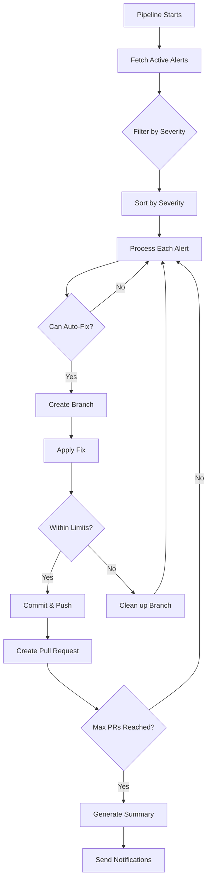

# Advanced Security Auto-Fix Pipeline for Azure DevOps

Automated pipeline that reads GitHub Advanced Security alerts in Azure DevOps and creates pull requests with security fixes.

## Features

- 🔍 Automatically scans Advanced Security alerts
- 🔧 Applies intelligent fixes based on vulnerability type
- 🔀 Creates pull requests with detailed descriptions
- 🎯 Filters by severity (critical, high, medium, low)
- 📊 Generates execution summaries
- 🔔 Optional Teams notifications
- ⚡ Configurable fix strategies
- 🛡️ Safety limits to prevent large changes

## Supported Vulnerability Types

The pipeline can handle various security issues:

- **SQL Injection** - Adds comments suggesting parameterized queries
- **XSS (Cross-Site Scripting)** - Suggests input sanitization
- **Hardcoded Credentials** - Comments out secrets, suggests Key Vault
- **Insecure Randomness** - Suggests using `secrets` module
- **Path Traversal** - Suggests path validation
- **Command Injection** - Adds manual review warnings
- **Generic Issues** - Adds security TODO comments

## Prerequisites

1. **GitHub Advanced Security for Azure DevOps** enabled on your repository
2. **Azure DevOps** with appropriate permissions:
   - Read access to Advanced Security alerts
   - Contribute to repository
   - Create pull requests
3. **Python 3.11+** (handled by pipeline)

## Setup Instructions

### 1. Enable Required Permissions

The pipeline needs access to the Advanced Security API. Grant the build service these permissions:

**Option A: Project Settings**
```
Project Settings → Repositories → Security
→ Find "[Project Name] Build Service"
→ Grant: Contribute, Create branch, Contribute to pull requests
```

**Option B: Repository Settings**
```
Repository → Security
→ Add "[Project Name] Build Service"
→ Permissions: Allow for all repository operations
```

### 2. Add Files to Your Repository

Add these files to your repository:

```
/
├── .azdo/
│   └── advanced-security-auto-fix.yml
├── scripts/
│   └── security_alert_fixer.py
└── security-fix-config.yml
```

### 3. Configure the Pipeline

#### Create Pipeline in Azure DevOps

1. Go to **Pipelines** → **New Pipeline**
2. Select **Azure Repos Git**
3. Choose your repository
4. Select **Existing Azure Pipelines YAML file**
5. Path: `/.azdo/advanced-security-auto-fix.yml`

#### Configure Variables (Optional)

Add pipeline variables for Teams notifications:

```yaml
Variables:
  - TeamsWebhookUrl: https://your-org.webhook.office.com/...
```

### 4. Customize Configuration

Edit `security-fix-config.yml` to customize behavior:

```yaml
# Example configuration
pr_config:
  branch_prefix: "security-fix"
  default_reviewers:
    - "your-security-team@company.com"
  auto_assign_reviewers: true

limits:
  max_prs_per_run: 5
  max_files_per_pr: 10
  max_lines_changed_per_file: 50

alert_strategies:
  sql-injection:
    enabled: true
    auto_fix: true
  
  hardcoded-credentials:
    enabled: true
    auto_fix: true
```

## Usage

### Manual Run

1. Go to **Pipelines** → Select your pipeline
2. Click **Run pipeline**
3. Configure parameters:
   - **Severity Filter**: critical, high, medium, or low
   - **Dry Run**: Test without creating PRs
4. Click **Run**

### Scheduled Run

The pipeline runs automatically daily at 2 AM (configurable in the YAML):

```yaml
schedules:
- cron: "0 2 * * *"  # Change time here
  displayName: Daily Advanced Security scan
  branches:
    include:
    - main
  always: true
```

### Pipeline Parameters

| Parameter | Description | Default | Options |
|-----------|-------------|---------|---------|
| severityFilter | Minimum severity to process | high | critical, high, medium, low |
| dryRun | Test mode (no PRs created) | false | true, false |

## How It Works



## Fix Strategies

### SQL Injection
```python
# Before (vulnerable)
query = f"SELECT * FROM users WHERE id = {user_id}"

# After fix (comment added)
# SECURITY FIX REQUIRED: SQL Injection vulnerability detected
# Replace string concatenation with parameterized queries
# Example: cursor.execute("SELECT * FROM users WHERE id = ?", (user_id,))
query = f"SELECT * FROM users WHERE id = {user_id}"
```

### Hardcoded Secrets
```python
# Before (vulnerable)
API_KEY = "sk-1234567890abcdef"

# After fix (commented out with warning)
# CRITICAL: Remove hardcoded secret. Use: secret = os.environ.get('SECRET_NAME')
# REMOVED: API_KEY = "sk-1234567890abcdef"
```

### XSS Prevention
```javascript
// Before (vulnerable)
element.innerHTML = userInput;

// After fix (comment added)
// SECURITY FIX REQUIRED: XSS vulnerability detected
// Sanitize output: Use DOMPurify.sanitize() or framework escaping
element.innerHTML = userInput;
```

## Pull Request Format

Created PRs include:

- **Title**: `[Security-HIGH] Fix SQL injection in user authentication`
- **Description**: 
  - Alert severity and type
  - File and line number
  - Detailed description
  - Fix explanation
  - Review checklist
- **Labels**: `security`, `automated-fix`, `severity-high`
- **Reviewers**: Auto-assigned based on configuration

## Safety Features

### Limits
- Maximum PRs per run (default: 5)
- Maximum files changed per PR (default: 10)
- Maximum lines changed per file (default: 50)

### Exclusions
Files matching these patterns are skipped:
- `*.min.js`, `*.min.css`
- `node_modules/**`
- `dist/**`, `build/**`

### Validation
- Branch existence check before creation
- Change size validation
- Git operations with error handling

## Monitoring and Reporting

### Pipeline Artifacts

Each run produces:
- **SecurityFixSummary**: JSON summary with metrics
- **Build Summary**: Markdown report in pipeline UI

### Summary JSON Structure
```json
{
  "timestamp": "2025-01-15T02:00:00",
  "total_alerts": 15,
  "alerts_processed": 5,
  "prs_created": 3,
  "processed_details": [
    {
      "alert_id": "123",
      "severity": "high",
      "status": "pr_created"
    }
  ],
  "status": "success"
}
```

### Teams Notifications

If configured, sends notifications with:
- Total alerts found
- Alerts processed
- PRs created
- Link to pipeline run

## Troubleshooting

### No Alerts Found
- Verify Advanced Security is enabled
- Check if there are active alerts in the UI
- Ensure API version is correct (7.2-preview.1)

### Permission Errors
```
Error 403: Insufficient permissions
```
**Solution**: Grant build service required permissions (see Setup step 1)

### PRs Not Created
```
Failed to create PR: 409 Conflict
```
**Solution**: Branch might already exist. Pipeline skips existing branches.

### Authentication Errors
```
Error fetching alerts: 401 Unauthorized
```
**Solution**: Ensure `System.AccessToken` is available:
```yaml
env:
  SYSTEM_ACCESSTOKEN: $(System.AccessToken)
```

## Advanced Configuration

### Custom Fix Strategies

Add custom strategies in `security-fix-config.yml`:

```yaml
alert_strategies:
  custom-vulnerability:
    enabled: true
    auto_fix: true
    fix_type: "custom"
    comment_template: |
      # Your custom fix instructions here
```

### Extending the Python Script

Add new fix methods in `security_alert_fixer.py`:

```python
def _fix_custom_vulnerability(self, alert: Dict, file_path: str, start_line: int) -> bool:
    """Custom fix implementation"""
    # Your fix logic here
    return True
```

### Integration with Other Tools

#### Link Work Items
```yaml
pr_config:
  link_work_items: true
  work_item_tag: "security"
```

#### Run Code Formatters
```python
# After applying fix
subprocess.run(['black', file_path])  # Python
subprocess.run(['prettier', '--write', file_path])  # JavaScript
```

## Best Practices

1. **Start with Dry Run**: Test with `dryRun: true` first
2. **Review PRs Carefully**: Automated fixes need human validation
3. **Configure Severity**: Start with `critical` and `high` only
4. **Set Reasonable Limits**: Don't create too many PRs at once
5. **Monitor Results**: Check pipeline summaries regularly
6. **Keep Config Updated**: Adjust strategies based on your needs
7. **Test Thoroughly**: Test all auto-fixes before merging

## Limitations

- **Auto-fixes are conservative**: Many fixes are comments suggesting changes
- **Language-specific**: Best support for Python, JavaScript, C#
- **Binary files**: Cannot process binary or compiled files
- **Complex refactoring**: Cannot handle large-scale code restructuring
- **False positives**: May process alerts that are false positives

## Security Considerations

- Pipeline runs with build service permissions
- Uses system access token (short-lived)
- Does not expose secrets in logs
- Creates branches instead of direct commits
- Requires PR review before merging

## Contributing

To improve fix strategies:

1. Edit `security_alert_fixer.py`
2. Add new fix methods for specific vulnerability types
3. Update `security-fix-config.yml` with new strategies
4. Test thoroughly in dry-run mode
5. Document changes in this README

## API References

- [Advanced Security API](https://learn.microsoft.com/en-us/rest/api/azure/devops/advancedsecurity/)
- [Azure DevOps Git API](https://learn.microsoft.com/en-us/rest/api/azure/devops/git/)
- [Pull Request API](https://learn.microsoft.com/en-us/rest/api/azure/devops/git/pull-requests/)

## Support

For issues or questions:
1. Check troubleshooting section
2. Review pipeline logs
3. Verify Advanced Security alerts in Azure DevOps UI
4. Check permissions and configuration

## License

This pipeline configuration is provided as-is for use in your Azure DevOps environment.
